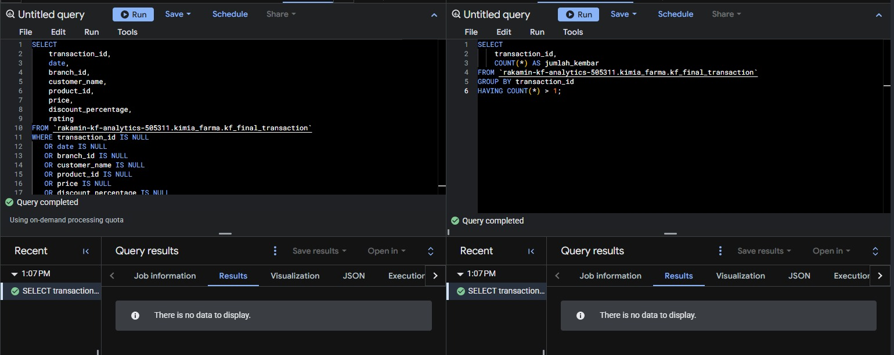
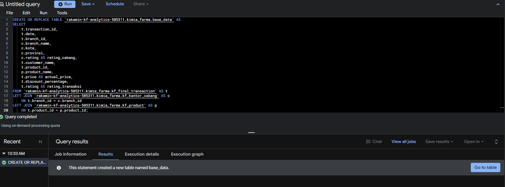
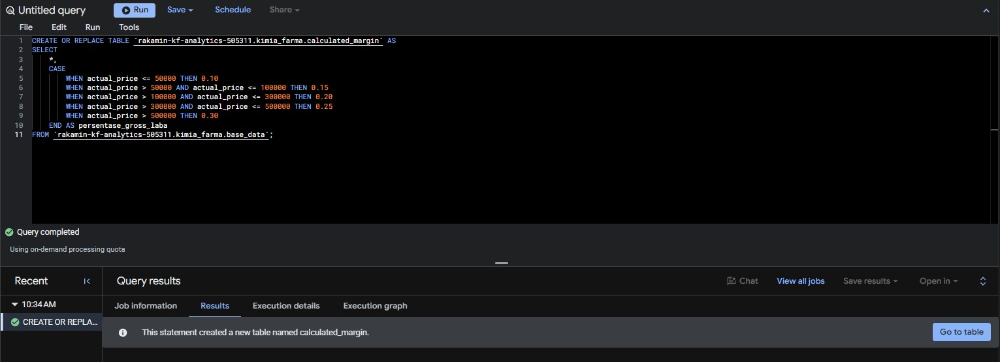
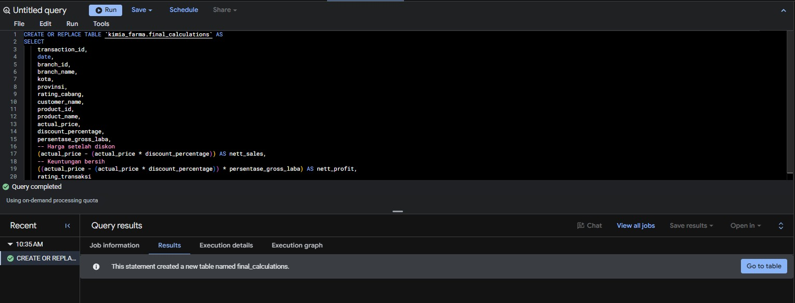
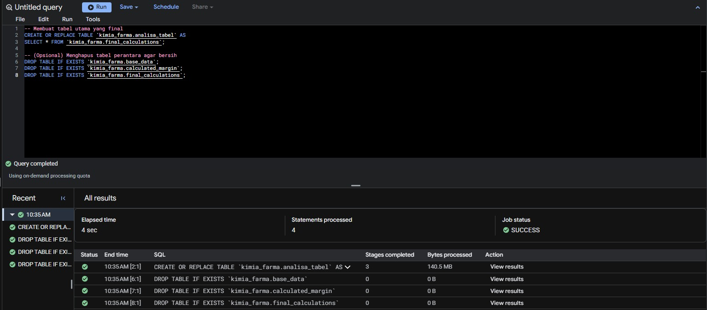
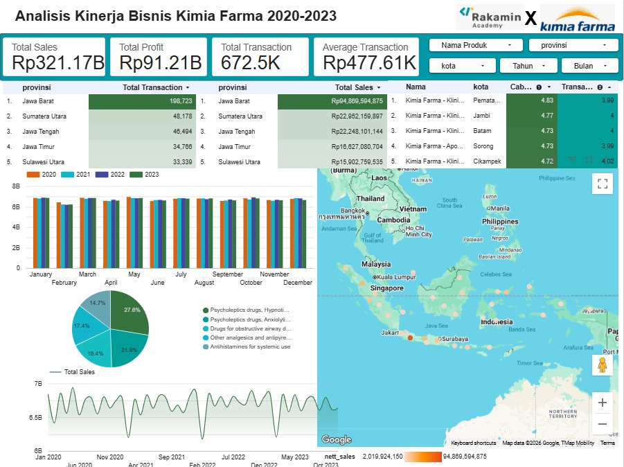

# Kimia Farma Big Data Analytics Project

Proyek analisis data untuk mengevaluasi performa bisnis PT Kimia Farma Tbk menggunakan BigQuery dan Looker Studio.

## 🛠️ Tech Stack
* **Google BigQuery:** Pengolahan data & SQL query.
* **Looker Studio:** Visualisasi dashboard interaktif.

## 📂 Struktur Dataset di BigQuery
* `kf_final_transaction`: Data transaksi penjualan.
* `kf_inventory`: Data inventaris stok.
* `kf_kantor_cabang`: Informasi cabang.
* `kf_product`: Data produk.
* `analisa_tabel`: Master tabel gabungan.

## 🧹 Data Quality Control (Pengecekan Duplikat & Missing Values)
Sebelum melakukan penggabungan tabel dan analisis lanjutan, dilakukan tahap *data validation* menggunakan Google BigQuery untuk memastikan integritas data:

1. **Pengecekan *Missing Values* (Nilai Kosong):**
   * Menggunakan query pemfilteran kondisi `IS NULL` pada setiap kolom penting (seperti `transaction_id`, `date`, `branch_id`, hingga `price` dan `rating`).
   * **Hasil:** Query mengembalikan hasil kosong (*"There is no data to display"*), yang menandakan bahwa **tidak ada data yang hilang/kosong** pada tabel transaksi utama.

2. **Pengecekan Data Duplikat:**
   * Menggunakan fungsi `GROUP BY` pada kolom `transaction_id` dengan klausa `HAVING COUNT(*) > 1` untuk mendeteksi ID transaksi yang tercatat ganda.
   * **Hasil:** Query mengembalikan hasil kosong, yang membuktikan bahwa **seluruh data transaksi bersifat unik** dan bebas dari duplikasi.
  
Berikut adalah tangkapan layar proses pengecekan di BigQuery:

## 🛠️ Tahapan Pembuatan Tabel Analisa (Modular SQL approach)
Proses transformasi data dilakukan secara bertahap untuk memastikan setiap kalkulasi teruji dengan baik:
1. **`base_data`**: Menggabungkan tabel transaksi, cabang, dan produk.
2. 
3. **`calculated_margin`**: Menentukan persentase gross laba berdasarkan rentang harga produk.
4. 
5. **`final_calculations`**: Menghitung metrik bisnis *Nett Sales* dan *Nett Profit*.
6. 
7. **`analisa_tabel`**: Tabel master final yang siap dihubungkan ke Looker Studio, diikuti dengan pembersihan tabel perantara.
8. 

## 📊 Dashboard
Berikut adalah tangkapan layar proses pembuatan dashboard di Looker studio/ data studio :

* https://datastudio.google.com/reporting/1c662792-c6d6-4715-8c85-aeba5575d8b7

## 💡 Key Insights & Kesimpulan Analisis
* **Performa Penjualan:** Total transaksi mencapai 672.5K dengan total *sales* sebesar Rp321.17B dan *nett profit* sebesar Rp91.21B.
* **Tren Tahunan:** Terdapat fluktuasi penjualan dari tahun ke tahun yang dapat dipantau langsung melalui interaktif filter di Looker Studio.
* **Distribusi Geografis:** Pemetaan cabang menunjukkan persebaran performa transaksi dan profit di berbagai provinsi di Indonesia.

## 👤 Author
* **Fadli Nurrizky**
